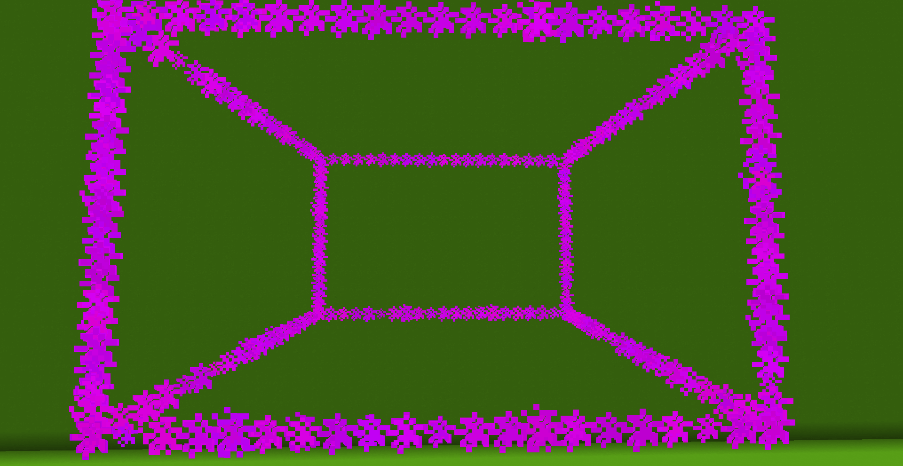

# Cuboid command

## Description

This effect spawns a cuboid! You can define its dimensions, the snapping to the blocks and the padding of the rows!

<figure><figcaption></figcaption></figure>

To use this command you will need to type:

> `/pal cuboid <paramters...>`

### Demo effect

To display the demo effect use:

> `/pal cuboid demo <particle> <posX> <posY> <posZ> <duration>`

This will spawn a 1x1 cube, without blockSnapping.

### Command Structure

The basic command structure for this effect is:

> `/pal cuboid <particle> <originPos> <useCorners> <target> <particlesPerRow> <padding> <blockSnap> <duration>`

* `particle` and `duration`have already been explained in the [General Information page](general-information.md).
* `originPos` is the first corner of the cuboid, the bottom left one.
* `useCorners` defines how the next paramter is used. If set to `true` the target parameter will be used as a position, a bit like the /fill command. If instead is set to `false`, it will represent the length in blocks of each axis.
* `target` is a set of 3 double values (so remember to add a floating point, like 1.0!), and dependes on the parameter above. It can either be the position of the top right corner of the cuboid, or the length of each axis.
* `particlesPerRow` is the number of particles that are going to make up each row of teh cuboid.
* `padding` is the padding to add to the sides of the cube, a sort of a way to expand it. If block snap is enabled, a padding of an integer (0, 1, 13...) will make the cuboid have the sides in the middle of the blocks. If you add a 0.5+k (where k is an integer), the cuboid will usually match the sides of the blocks.
* `blockSnap` if set to true will adapt the effect so it snaps to the blocks.

<table data-view="cards"><thead><tr><th></th><th></th><th data-hidden data-card-cover data-type="files"></th></tr></thead><tbody><tr><td>Without the blockSnap</td><td></td><td><a href="../.gitbook/assets/2025-02-12_12.37.23.png">2025-02-12_12.37.23.png</a></td></tr><tr><td>With blocksnap and 0.5 padding</td><td></td><td><a href="../.gitbook/assets/2025-02-12_12.38.00.png">2025-02-12_12.38.00.png</a></td></tr><tr><td></td><td></td><td><a href="../.gitbook/assets/2025-02-12_12.37.51.png">2025-02-12_12.37.51.png</a></td></tr></tbody></table>
