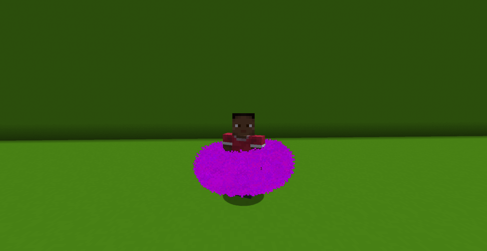

# Donut command

## Description

This effect spawns a donut! A donut is made up of a series of circles, forming a tube and a hole at the center! You can specify how big they are, how many, and how and if it should grow! Also know as the torus effect.

<figure><figcaption></figcaption></figure>

To use this command you will need to type:

> `/pal donut <paramters...>`

### Demo effect

To display the demo effect use:

> `/pal donut demo <particle> <posX> <posY> <posZ> <duration>`

This will spawn a donut oriented to +/- Z, with the hole around 1.5 blocks big.

### Command Structure

The basic command structure for this effect is:

> `/pal donut <particle> <originPos> <particlesPerCircle> <circles> <radiusDonut> <radiusTube> <rotation> <radDonutIncrease> <radTubeIncrease> <particlesIncrease> <particlesIncreaseEvery> <circlesIncrease> <circlesIncreaseEvery> <duration>`
>
> or
>
> `/pal donut <particle> <originPos> <yaw> <pitch> <particlesPerCircle> <circles> <radiusDonut> <radiusTube> <rotation> <radDonutIncrease> <radTubeIncrease> <particlesIncrease> <particlesIncreaseEvery> <circlesIncrease> <circlesIncreaseEvery> <duration>`

* `particle`, `originPos`, `yaw`, `pitch` and `duration`have already been explained in the [General Information page](general-information.md).
* `particlesPerCircles` idetermines by how many particles each circle forming the donut is made up. More particles mean more defined circles and thus, donuts.
* `circles` is the total number of circles that make up the donut. More circles, the more the donut will be defined. For context, the demo effect uses 36 of them!
* `radiusDonut` is the radius of the whole donut/torus itself.
* `radiusTube` is the radius of the circles, which make up the tube around the hole of the donut.
* `rotation` is a set of three double values, referring to the rotation of the donut/torurs effect (keep in mind that one of the directions won't change anything since it's a circle!)
* `radDonutIncrease` referes to how much the dount should increase in size each iteration (aka each tick!). Low values of like 0.01 are recommended unless you want a very big effect!.
* `radTubeIncrease` similar to the last one, but this referes to radius of the tube!
* `particlesIncrease` again, defines by how many particles the circles should grow each iteration, or each number of iterations (see below)
* `particlesIncreaseEvery` defines the number of iterations (ticks) that need to pass before incrementing the number of particles by the number speciefied earlier
* `circlesIncrease` defines by how many circles the tube should grow each iteration, or each number of iterations (see below)
* `circlesIncreaseEvery` defines the number of iterations (ticks) that need to pass before incrementing the number of circles by the number speciefied earlier

<table data-view="cards"><thead><tr><th></th><th></th><th data-hidden data-card-cover data-type="files"></th></tr></thead><tbody><tr><td>Too few circles</td><td><code>/pal donut ...</code></td><td><a href="../.gitbook/assets/2025-02-16_12.19.17.png">2025-02-16_12.19.17.png</a></td></tr><tr><td>The inside of the tube</td><td><code>/pal donut ...</code></td><td><a href="../.gitbook/assets/2025-02-16_12.20.33.png">2025-02-16_12.20.33.png</a></td></tr><tr><td></td><td></td><td></td></tr></tbody></table>
