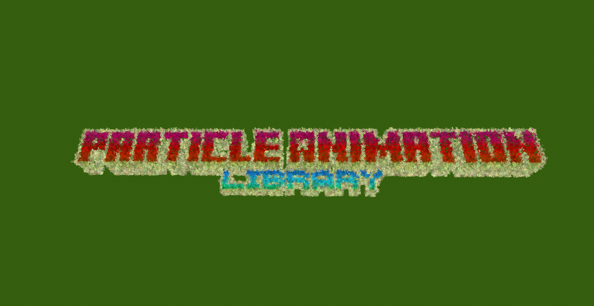

# Image command

## Description

This effect displays a custom Image! Both in colored form or even in black and white or inverted colors! Transparency is also supported, along with ways to rotate the image and other stuff.

To achive this effect, Dust particles are used to represent each (sort of) pixel of the image. You can customize their size to cover more or less pixels of the image.

<figure><figcaption></figcaption></figure>

To use this command you will need to type:

> `/pal image <paramters...>`

### Demo effect

To display the demo effect use:

> `/pal image demo <filePath> <posX> <posY> <posZ> <duration>`

This will spawn a transparent static image. The filePath paramter is described below

### Command Structure

The basic command structure for this effect is:

> `/pal image <filePath> <originPos> <transparent> <scale> <particleSize> <stepX> <stepY> <orient> <rotation> <rotatesDynamically> <angVelocity> <blackAndWhite> <invertColors> <duration>`
>
> or
>
> `/pal image <filePath> <originPos> <yaw> <pitch> <transparent> <scale> <particleSize> <stepX> <stepY> <orient> <rotation> <rotatesDynamically> <angVelocity> <blackAndWhite> <invertColors> <duration>`

* `originPos` , `yaw`, `pitch` and `duration`have already been explained in the [General Information page](general-information.md).
* `filePath` is a string that points to an image file. This can either be a URL to a remote image, or a local path on your machine. It can even be an Identifier, like a texture file inside a datapack (and not resourcepack!!! This is because this mod runs only on server side!).&#x20;

Valid examples include: <mark style="color:green;">"</mark>[<mark style="color:green;">https://fabricmc.net/assets/logo.png</mark>](https://fabricmc.net/assets/logo.png)<mark style="color:green;">"</mark> - <mark style="color:green;">For remote url (the fabric logo)</mark> — <mark style="color:purple;">"C:\\\Users\\\\\<yourusername>\\\Desktop\\\amazing\_image.png"</mark> - <mark style="color:purple;">For a local path</mark> — <mark style="color:orange;">"palcommands:images/image.png"</mark> - <mark style="color:orange;">For an identifier inside a datapack</mark>


If you get an error like "Invalid escape sequence", it means you have to use double slashes \\\ instead of single onese in your path. This is beacuse single slashes are used to make special actions in strings.


* `transparent` if set to true, PNGs with transparent areas won't display any particles, if set to false those areas will be white (like a jpg)
* `scale` allows you to scale up or down the image. Usually you will scale it down with values around 0.4 (for example with the fabricmc logo)
* `particleSize` is the size of the dust particles. Bigger values (1.1+) can help cover holes in the image
* `stepX and stepY` define how many particles/pixels to skip before displaying the image. This is done to save up on memory and prevent freezes. You can combine this with particleSize to have good quality images without expending too many resources. Lower values mean better fidelty/resolution/quality for the images, higher values will skip more pixels and thus making a lower quality image (bear in mind that we are indeed, displaying an image inside minecraft using particles!)
* `orient` if set to true allows the image to orient towards the specified yaw and pitch, or towards the player-
* `rotation` applies a fixed rotation to the images. The three double floating point values for x,y,z are expressed in radians.
* `rotatesDynamically` allow the image to rotate around with a certain angular velocity
* `angVelocity` is antoher set ot three double values in radians, and specifies the velocity with which the image rotates
* `blackAndWhite` will display the image in black and white colors instead of its original ones
* `invetedColors` will display the negative of the image, with its colors inverted

<table data-view="cards"><thead><tr><th></th><th></th><th data-hidden data-card-cover data-type="files"></th></tr></thead><tbody><tr><td>The standard circle</td><td><code>/pal animatedcircle minecraft:soul_fire_flame ~ ~ ~ 50 2 0 3.14 true false false 0.0 0.0 0.0 0.0 0.0 0.0 5</code></td><td><a href="../.gitbook/assets/2025-02-10_18.41.32.png">2025-02-10_18.41.32.png</a></td></tr><tr><td>A semi circle</td><td><code>/pal animatedcircle minecraft:soul_fire_flame ~ ~ ~ 50 2 0 3.14 true true false 0.0 0.0 0.0 0.0 0.0 0.0 5</code></td><td><a href="../.gitbook/assets/2025-02-10_18.04.29.png">2025-02-10_18.04.29.png</a></td></tr><tr><td>Adding some angular velocity</td><td><code>/pal animatedcircle minecraft:soul_fire_flame ~ ~ ~ 50 2 0 3.14 false false true 2.0 0.0 0.0 0.0 0.0 0.0 5</code></td><td><a href="../.gitbook/assets/AnimatedCircle example 2.gif">AnimatedCircle example 2.gif</a></td></tr><tr><td>Example of messing around with parameters (angularVelocity x=2.0)</td><td><code>/pal animatedcircle minecraft:electric_spark ~ ~ ~ 50 2 0 7 true false true 0.0 2.0 0.0 0.0 0.0 0.0 3</code></td><td><a href="../.gitbook/assets/Cool animation.gif">Cool animation.gif</a></td></tr><tr><td></td><td></td><td></td></tr></tbody></table>
