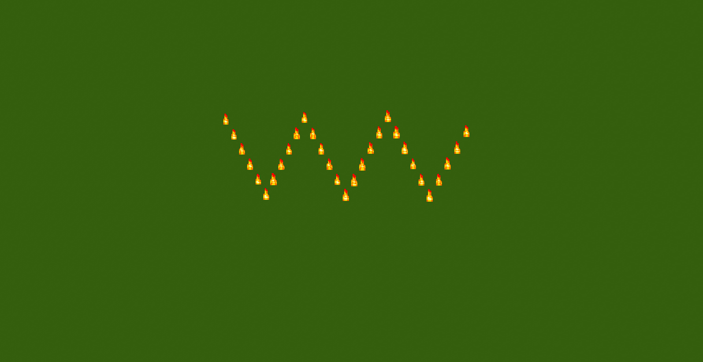

# Line command

## Description

This effect will display a line! Even a zig-zag one! Ok it's just a line, but you can do cool stuff with multiple lines! (Using the API instead of the commands will allow you to spawn another effect at the end of the line btw)

<figure><figcaption>
/pal line minecraft:flame ~ ~ ~ ~ ~ ~8 30 1000 true 6 .0 .5 .0 .0 .0 .0 5
</figcaption></figure>

To use this command you will need to type:

> `/pal line <paramters...>`

### Demo effect

To display the demo effect use:

> `/pal line demo <particle> <posX> <posY> <posZ> <duration>`

This will spawn a line oriented towards positive Z from the point you spawn it in and 4 blocks long.

### Command Structure

The basic command structure for this effect is:

> `/pal line <particle> <origin> <target> <count> <maxLength> <zigZag> <zigZagsNumber> <zigZagOffset> <zigZagRelativeOffset> <duration>`
>
> or
>
> `/pal line <particle> <origin> <count> <length> <zigZag> <zigZagsNumber> <zigZagOffset> <zigZagRelativeOffset> <duration>`
>
> or
>
> `/pal line <particle> <origin> <yaw> <pitch> <count> <length> <zigZag> <zigZagsNumber> <zigZagOffset> <zigZagRelativeOffset> <duration>`

* `origin` , `particle`, `yaw`, `pitch`, `target` and `duration`have already been explained in the [General Information page](general-information.md).
* `count` is the number of particles that make up the line from start to end
* `maxLength` is used when selecting a target point, and determines the upper bound of the length of the line
* `length` is used in place of target and determines how long the line will be
* `zigZag` allows the line to have zig zags! (Note: you may get strange behviours here, try to change the number of particles too and see what happens!) (These options are not very well supported, sorry!)
* `zigZagsNumber` is the number of zigzags in the line (to have a proper vertex the minimu number is 2)
* `zigZagOffest` is a set of three double values representing the direction of the zigZags
* `zigZagRelativeOffest` is a set of three double values representing the relative direction of the zigZags

<table data-view="cards"><thead><tr><th></th><th></th><th data-hidden data-card-cover data-type="files"></th></tr></thead><tbody><tr><td>The standard circle</td><td><code>/pal animatedcircle minecraft:soul_fire_flame ~ ~ ~ 50 2 0 3.14 true false false 0.0 0.0 0.0 0.0 0.0 0.0 5</code></td><td><a href="../.gitbook/assets/2025-02-10_18.41.32.png">2025-02-10_18.41.32.png</a></td></tr><tr><td>A semi circle</td><td><code>/pal animatedcircle minecraft:soul_fire_flame ~ ~ ~ 50 2 0 3.14 true true false 0.0 0.0 0.0 0.0 0.0 0.0 5</code></td><td><a href="../.gitbook/assets/2025-02-10_18.04.29.png">2025-02-10_18.04.29.png</a></td></tr><tr><td>Adding some angular velocity</td><td><code>/pal animatedcircle minecraft:soul_fire_flame ~ ~ ~ 50 2 0 3.14 false false true 2.0 0.0 0.0 0.0 0.0 0.0 5</code></td><td><a href="../.gitbook/assets/AnimatedCircle example 2.gif">AnimatedCircle example 2.gif</a></td></tr><tr><td>Example of messing around with parameters (angularVelocity x=2.0)</td><td><code>/pal animatedcircle minecraft:electric_spark ~ ~ ~ 50 2 0 7 true false true 0.0 2.0 0.0 0.0 0.0 0.0 3</code></td><td><a href="../.gitbook/assets/Cool animation.gif">Cool animation.gif</a></td></tr><tr><td></td><td></td><td></td></tr></tbody></table>
