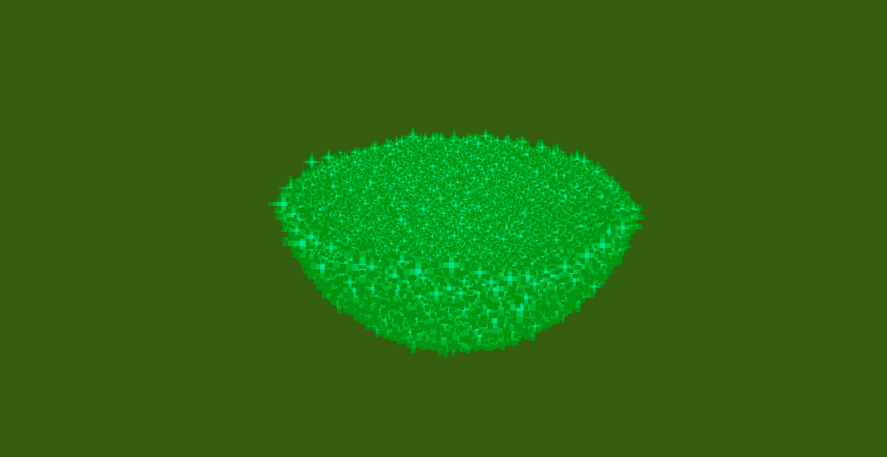

# Sphere command

## Description

This effect will spawn a (hollow) sphere, or half of it! You can set it to expand, or use it as a sort of forcefield around a player! This also one of the least complicated effects.

<figure><figcaption>
/pal line minecraft:flame ~ ~ ~ ~ ~ ~8 30 1000 true 6 .0 .5 .0 .0 .0 .0 5
</figcaption></figure>

To use this command you will need to type:

> `/pal sphere <paramters...>`

### Demo effect

To display the demo effect use:

> `/pal sphere demo <particle> <posX> <posY> <posZ> <duration>`

This will spawn a small 1x1 full hollow sphere.

### Command Structure

The basic command structure for this effect is:

> `/pal sphere <particle> <originPos> <count> <radius> <radiusIncrease> <particleIncrease> <halfSphere> <invertHalfSphere> <duration>`

* `originPos` , `particle` and `duration`have already been explained in the [General Information page](general-information.md).
* `count` is the number of particles that make up the sphere, the more, the merrier.
* `radius` is the radius of the sphere
* `radiusIncrease` is how much to increase the sphere of each iteration/tick, usually you will want to keep it low (0.01-0.2) (it can also be neagtive!)
* `particleIncrease` is the number of extra particles to spawn each iteration/tick, usually you will want to keep it low (1-2)
* `halfSphere` if set to true will display only half of the sphere
* `invertSphere` allows you to display the other half of the sphere

<table data-view="cards"><thead><tr><th></th><th></th><th data-hidden data-card-cover data-type="files"></th></tr></thead><tbody><tr><td>The standard halfsphere</td><td><code>/pal sphere minecraft:egg_crack ~ ~ ~ 200 2 0 1 true false 5</code></td><td><a href="../.gitbook/assets/2025-02-16_17.21.30.png">2025-02-16_17.21.30.png</a></td></tr><tr><td>The inverted halfsphere</td><td><code>/pal sphere minecraft:egg_crack ~ ~ ~ 200 2 0 1 true false 5</code></td><td><a href="../.gitbook/assets/2025-02-16_17.21.03.png">2025-02-16_17.21.03.png</a></td></tr><tr><td>The sphere growing really fast and nicely</td><td><code>/pal sphere minecraft:witch ~6 ~2 ~ 200 2 0.1 1 false false 5</code></td><td><a href="../.gitbook/assets/AnimatedCircle example 2.gif">AnimatedCircle example 2.gif</a></td></tr></tbody></table>
