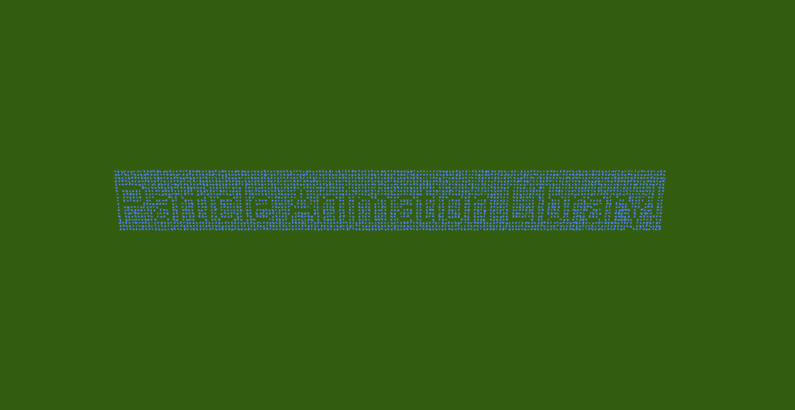

# Text command

## Description

This effect will spawn a custom text with a custom font!

<figure><figcaption>
/pal text minecraft:dolphin ~ 1 ~ "Particle Animation Library!" true 1 1 0.1 "Comic Sans" plain 15 3
</figcaption></figure>

To use this command you will need to type:

> `/pal text <paramters...>`

### Demo effect

To display the demo effect use:

> `/pal text demo <particle> <text> <posX> <posY> <posZ> <duration>`

This will spawn an "Hello world" facing the positive Z direction, using Arial plain, size 15! (About 1x5 blocks)

### Command Structure

The basic command structure for this effect is:

> `/pal text <particle> <originPos> <text_to_display> <invert> <stepX> <setpY> <size> <font_name> <font_style> <font_size> <duration>`

* `originPos` , `particle` and `duration`have already been explained in the [General Information page](general-information.md).
* `text_to_display` is the text that will be dispalyed. You should input it like <kbd>"Hello world!"</kbd> (Note: some unicode characters are not supported and will display as rectangles)
* `invert` makes the text dispaly as it has been hollowed out of a rectangle
* `stepX and stepY` define how many particles/pixels to skip to save up on memory. To have a good result, keep them between 0 and 5.
* `size` is a float value used to scale up or down the displayed text, and works on top the font size
* `font_name` is the name of the font you want to use, like <kbd>"Calibri"</kbd>. You can use `/pal fontlist` to get a list of all the supported fonts
* `font_style` is the style to apply to the font. Valid values are <kbd>plain</kbd> , <kbd>bold</kbd> and <kbd>italic</kbd> (without "")
* `font_size` is the size of the font. Higher values will produce a better quality result (around 15 is my suggestion, with a size of 0.1)

<table data-view="cards"><thead><tr><th></th><th></th><th data-hidden data-card-cover data-type="files"></th></tr></thead><tbody><tr><td>The standard halfsphere</td><td><code>/pal sphere minecraft:egg_crack ~ ~ ~ 200 2 0 1 true false 5</code></td><td><a href="../.gitbook/assets/2025-02-16_17.21.30.png">2025-02-16_17.21.30.png</a></td></tr><tr><td>The inverted halfsphere</td><td><code>/pal sphere minecraft:egg_crack ~ ~ ~ 200 2 0 1 true false 5</code></td><td><a href="../.gitbook/assets/2025-02-16_17.21.03.png">2025-02-16_17.21.03.png</a></td></tr><tr><td>The sphere growing really fast and nicely</td><td><code>/pal sphere minecraft:witch ~6 ~2 ~ 200 2 0.1 1 false false 5</code></td><td><a href="../.gitbook/assets/AnimatedCircle example 2.gif">AnimatedCircle example 2.gif</a></td></tr></tbody></table>
