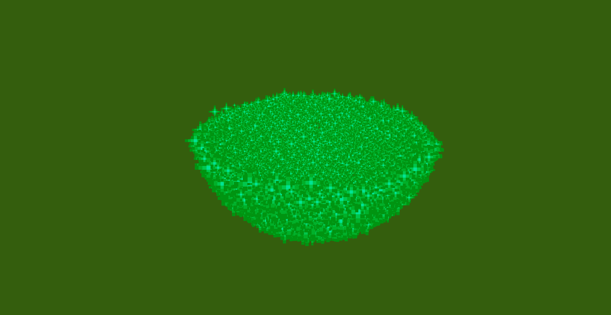

# Vortex command

## Description

This effect will spawn a vortex of particles! You can invert it, make it grow or shrink etc.

<figure><figcaption>
/pal line minecraft:flame ~ ~ ~ ~ ~ ~8 30 1000 true 6 .0 .5 .0 .0 .0 .0 5
</figcaption></figure>

To use this command you will need to type:

> `/pal vortex <paramters...>`

### Demo effect

To display the demo effect use:

> `/pal vortex demo <particle> <posX> <posY> <posZ> <duration>`

This will spawn a circlurar vortex oriented towards positive Z and radius of 1 block

### Command Structure

The basic command structure for this effect is:

> `/pal vortex <particle> <originPos> <count> <radius> <radiusGrow> <startRange> <lengthGrow> <radialsPerIteration> <circles> <helixes> <flipped> <duration>`
>
> or
>
> `/pal vortex <particle> <originPos> <yaw> <pitch> <count> <radius> <radiusGrow> <startRange> <lengthGrow> <radialsPerIteration> <circles> <helixes> <flipped> <duration>`

* `originPos` , `particle`, `yaw`, `pitch` and `duration`have already been explained in the [General Information page](general-information.md).
* `count` is the number of particles that make up the vortex effect, the more, the merrier.
* `radius` is the radius of the vortex
* `radiusGrow` is how much to increase the vortex of each iteration/tick, usually you will want to keep it low (0.01-0.2) (it can also be neagtive!)
* `startRange` is the intially range of the vortex
* `lengthGrow` is how much to increase the length of the vortex on each iteration/tick, similar to the radius grow
* `radialsPerIteration` is the angular rotation applied each iteration
* `circles` is the number of circles of which the vortex is made up of (which also contributes to its length)
* `helixes` is the number of helixes that the vortex makes
* `flipped` is used to filp the vortex, swapping the endpoint with the start point, similar to what happens in the ConEffect

<table data-view="cards"><thead><tr><th></th><th></th><th data-hidden data-card-cover data-type="files"></th></tr></thead><tbody><tr><td>The standard halfsphere</td><td><code>/pal sphere minecraft:egg_crack ~ ~ ~ 200 2 0 1 true false 5</code></td><td><a href="../.gitbook/assets/2025-02-16_17.21.30.png">2025-02-16_17.21.30.png</a></td></tr><tr><td>The inverted halfsphere</td><td><code>/pal sphere minecraft:egg_crack ~ ~ ~ 200 2 0 1 true false 5</code></td><td><a href="../.gitbook/assets/2025-02-16_17.21.03.png">2025-02-16_17.21.03.png</a></td></tr><tr><td>The sphere growing really fast and nicely</td><td><code>/pal sphere minecraft:witch ~6 ~2 ~ 200 2 0.1 1 false false 5</code></td><td><a href="../.gitbook/assets/AnimatedCircle example 2.gif">AnimatedCircle example 2.gif</a></td></tr></tbody></table>
